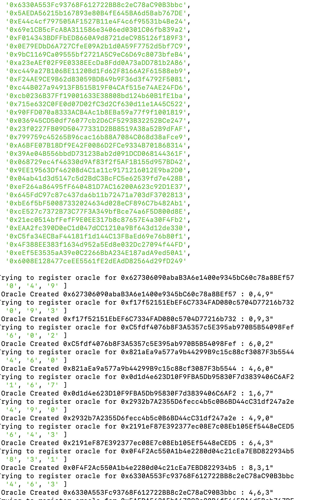
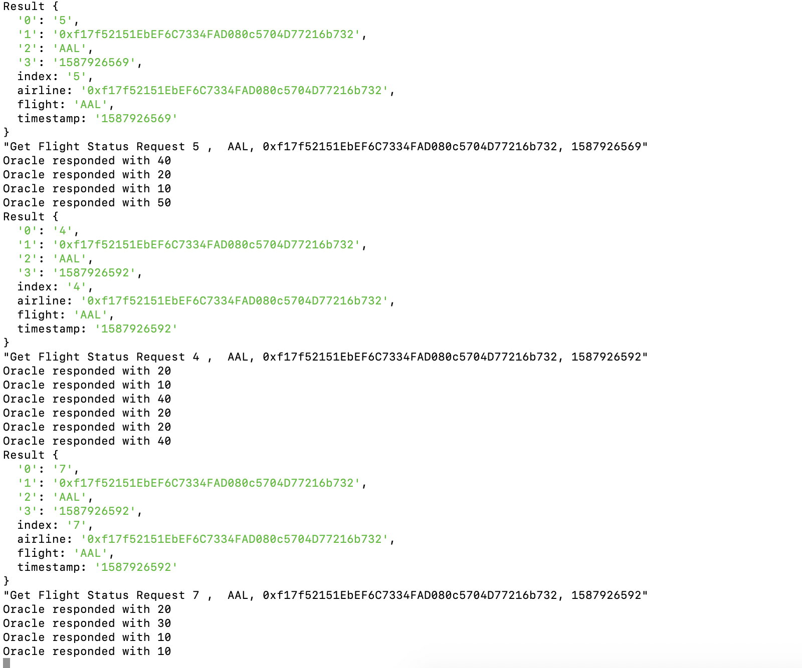
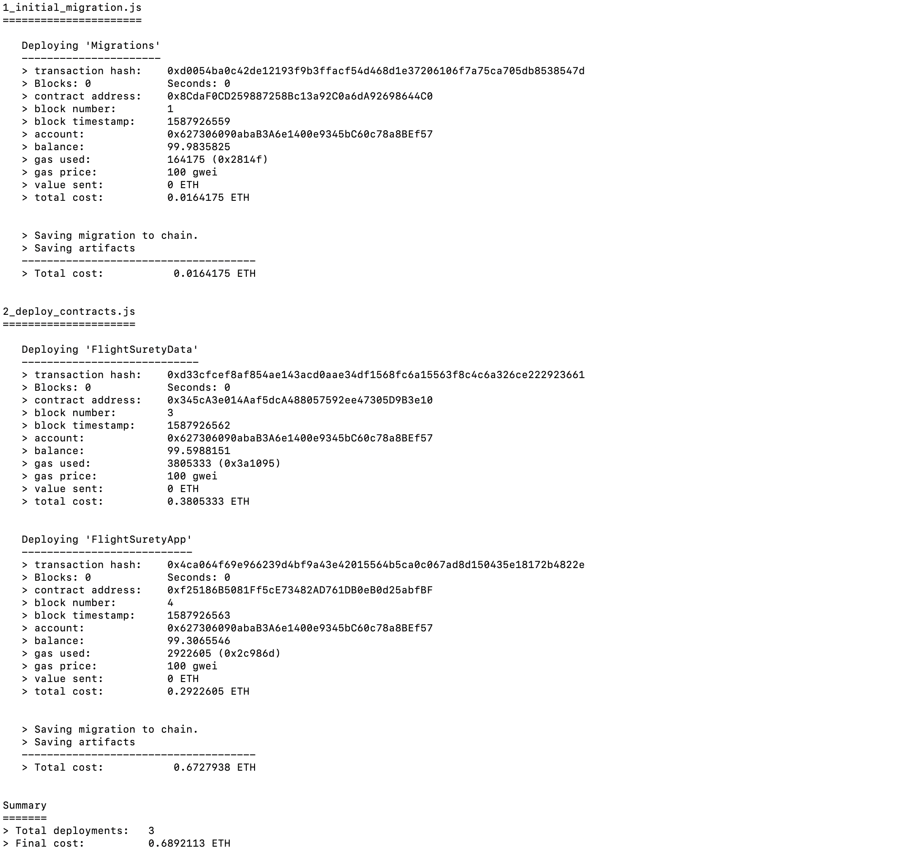
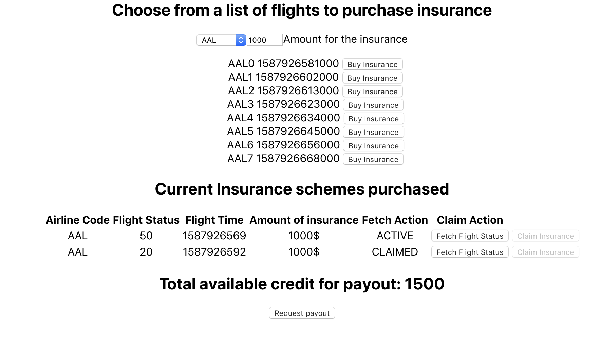
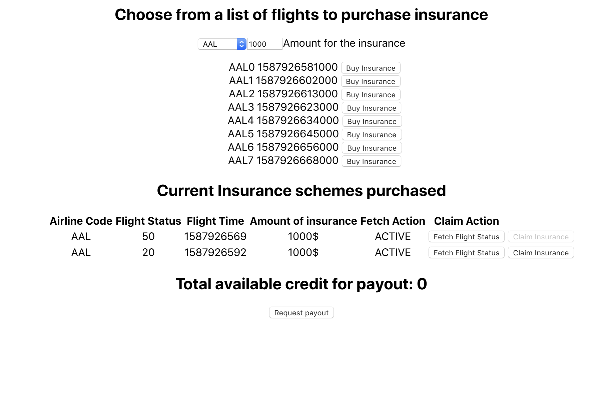

## Running Instructions
Flight Surety App is an app to buy insurance for flights.

### Project Architecture
The app has 3 modules
- Solidity Contracts
- Client Dapp
- Oracle Server App

### Running Instructions
#### Solidity 
- `rm -rf node_modules`
- `npm install`
- `truffle compile`
- make sure ganache is running on port 8545
- `truffle migrate --reset`

#### testing
- oracle (`truffle test ./test/oracle.js`)
- flightsurety (`truffle test ./test/flightSurety.js`)  
- TestFlightSuretyApp (`truffle test ./test/TestFlightSuretyApp.js`)  

### Running Instructions
#### Restart Ganache on port 8545
#### comple and deploy solidity contracts
- `truffle compile`
- `truffle migrate --reset`

#### Run Dapp
- `cd client`
- `rm -rf node-modules`
- `npm install`
- `npm run start`

#### Run Server App
- `cd server`
- `rm -rf node_modules`
- `npm install`
- `npm run start`

#### Screen shots

